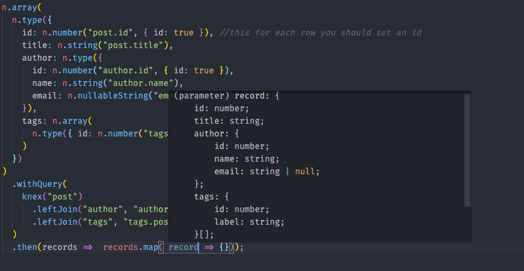

# Nested Knex

Takes a knex.js query builder add select and return nested object with types using (NestHydration)[].
idea for types and runtime comes from io-ts module

# Idea

I just wanted to get nested objects from knex.js, I did not like boilerplated ORMs.

## Every Select should have it's own types

one of the problems with ORMs is that you define your models and when it comes to relations you define them and connect all of them together but most of time you don't need to get all of the relationships. image a post model like this

```typescript
@Entity()
class Post {
  @PrimaryKey();
  id: number;

  @Column()
  body: string;

  @BelongsTo(type => Author)
  author? Author;
}


@Entity()
class Author {
  @PrimaryKey()
  id: number;

  @Column()
  name: string;
}
```

and you use the generic function to get data so maybe something like this `Post.find({relations: ['author']})` then in another function you use `Post.find()` in the first it will populate the `post.author` but in the second one the `author` is null.
the idea is that every select should have it's own type not a generic one.

## Knex.js is a Query Builder

also knex.js is just a query builder not an ORM that decide how to get data for you and make horrible mistakes.

## Runtime Type Check

> _right now I did not have time to write runtime check but the api is there I can work out the detail_

so what if we query the database and we wanted a `number` but a gets a `string` or even worse get a `null` should we continue our work? even typescript cannot help us.

# Getting Started

first install knex and drivers you want then you can install

```
npm install nested-knex
```

so we want to get an array of posts and every post have an author and a list of tags

```typescript
import * as n from 'nested-knex';

n.array(
  n.type({
    id: n.number('post.id', { id: true }), //this for each row you should set an id
    title: n.string('post.title'),
    author: n.type({
      id: n.number('author.id', { id: true }),
      name: n.string('author.name'),
      email: n.nullableString('email'),
    }),
    tags: n.array(n.type({ id: n.number('tags.id'), label: n.string('tags.title') })),
  }),
)
  .withQuery(
    knex('post')
      .leftJoin('author', 'author.id', 'post.authorId')
      .leftJoin('tags', 'tags.postId', 'post.id'),
  )
  .then(records => {
    /*
        records will be like

        [
          {
            id:1,
            title: 'Test',
            author: {id: 1, name: 'Hadi Aliakbar', email: null},
            tags: [{id:1, label: 'test'}]
          },
          {
            id:2,
            title: 'Test2',
            author: {id: 2, name: 'Mohammad Hadi Aliakbar', email: "hadi.aliakbar@gmail.com"},
            tags: [{id:2, label: 'test2'}, {id:3, label: 'test3'}]
          }
        ]
        
      */
  });
```

and also we have types



# Implemented Types

| Function         | Type            |
| ---------------- | --------------- |
| `nullableType`   | `{} | null`     |
| `type`           | `{}`            |
| `number`         | `number`        |
| `string`         | `string`        |
| `date`           | `date`          |
| `boolean`        | `boolean`       |
| `nullableNumber` | `number | null` |
| `nullableString` | `string | null` |
| `nullableDate`   | `date | null`   |
| `array`          | `[]`            |

# RoadMap

- run time type checks
- default option
- add a way to extend types
- add intersection union and partial types
